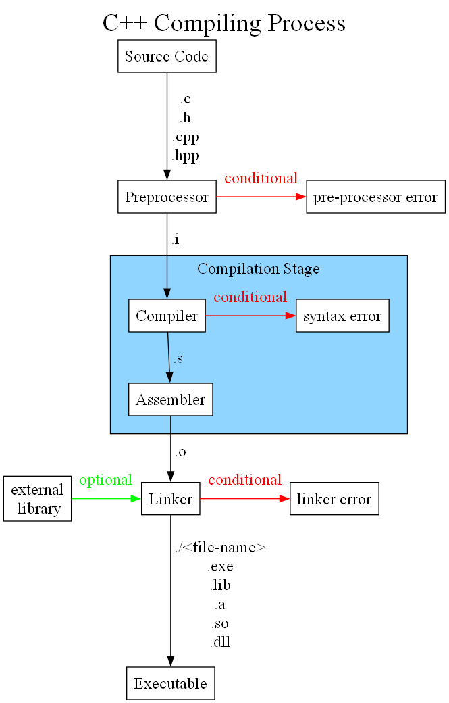

Compiling a program can be seen a simple process that, to most people, something magically happens on your computer. It appears to be an easy process that doesn't take much thought, because look at it automatically happens before your eyes. Just put your source code in your favorite IDE and press build. Boom, there it goes, an executable or a dynamic/static library gets created. 

Let's take a look what really happens under the hood of the compiling car and take a few hot laps around the compiling track. We might need to a pit-stop to add more fancy parts to our compiling racecar

## Compiling Stage
https://www.youtube.com/watch?v=3tIqpEmWMLI

translation units --- files don't exist in C++ (.cpp) it just something we humans understand and can manipulate, object files are what the compiler sees, these are translation units

a file is something that feeds the compiler some source code. the file extension tells what type of compiler it needs, and with .cpp file, it needs a C++ compiler

## Preprocessor Stage

## optimization

## linking stage
https://www.youtube.com/watch?v=H4s55GgAg0I

## Resources
[Compiling Articles](https://www.reddit.com/r/cpp/comments/khnng2/a_tutorial_for_absolute_beginners_to_understand/)