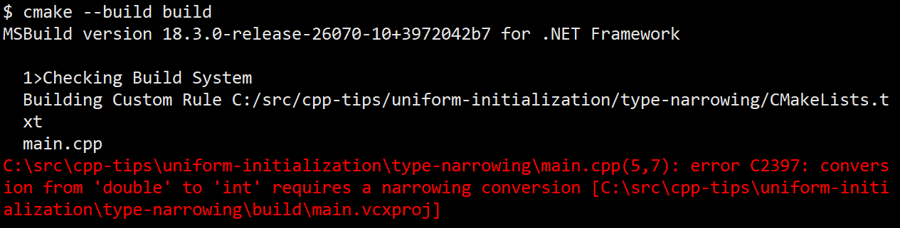

# C++ Tip Series
For all the code in this series, the repository is located [here](https://github.com/KielCruey/cpp-tips) in the 'cpp-tips' directory.

## What is Uniform Initialization?
Uniform Initialization is a new feature in C++11 that allows a different syntax to initializing variables and primitive types by using the braces {}.
However, it isn't just another trivial way to initialize, but it also has the mechanism to enforce safety checks.

The safety error checking characteristics are:
* Prevents type conversation narrowing
* Guarantees initialization

## C++ Initialization
There are multiple ways of initialization variables and classes, here are just a few examples:

```c++ title="Types of initialization"
int x; // uninitialized type

int x = 10; // Copy Initialization
int y = 10; // Value/Direct Initialization
int z {10}; // Uniform/Brace/List Initialization 
int a[3] = { 4,5,6 } // Aggregate initialization

X x1(); // default constructor
X x2(1); // Parameterized constructor
X x1 = x2; // copy-constructor initialization

std::vector<int> vector{ 1,2,3,4,5 } // initializer list
```

## Examples of Safety Checks
Lets take a look at type conversation narrowing and guarantees initialization.

### Prevents Type Narrowing
```c++ title="Type Narrowing Examples"
int main() {
	int a{ 2 }; // okay
	int b = 3.9; // okay -- but type narrowing occurs
	int c( 4.2 ); // okay -- but type narrowing occurs
	int d{ 2.3 }; // error -- narrowing from double to int
	
	return 0;
}
```



### Guarantees Initialization
Unlike any other initialization, uniformed initialization will promise a zero or NULL ("0") if nothing is declared.

Here are some examples:
```c++ title="Guarantees Initialization Examples"
int main() {
    int a; // okay -- will be populated with any unknown int value
    int b(); // nothing gets initialized
    int c(3); // okay - "3"
    int d{}; // okay -- guarantees an initialized value of "0"
    int e{ 5 }; // okay -- "5"
	
    return 0;
}
```

As we can see from the debugging console, variable "b" wasn't created at all, which is an issue related to C++ safety.

Also, variable "a" for my instance of happens to be initialized with an integer value of "387".


## Summary
Use uniform initialization whenever possible, because initializing variables or classes with "garbage" values or completely nothing is created, is an issue you want to avoid. Uniform initialization will throw a compiling error if something is wrong. However, C++ has an ideology to prevent or eliminate undefined behaviors and uniform initialization supports "safe, healthy, and efficient" programming.

# Resources
[Uniform Initialization](https://www.geeksforgeeks.org/cpp/uniform-initialization-in-c/)

[Microsoft Initialzers](https://learn.microsoft.com/en-us/cpp/cpp/initializers?view=msvc-170)

[Initialization in modern C++ - Timur Doumler](https://www.youtube.com/watch?v=ZfP4VAK21zc) -- refer to 24:23 time stamp

[C++ Safety](https://safecpp.org/draft.html)